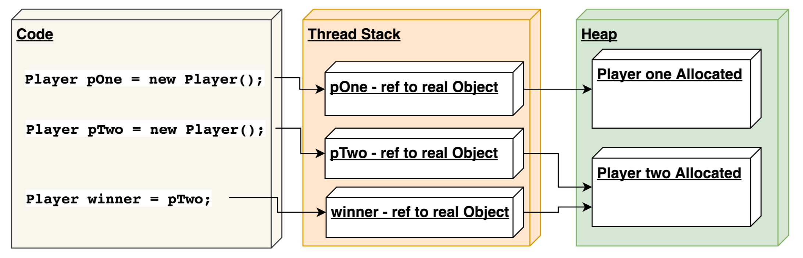

## Java As A Second Language
### Lecture 02
### Classes and Objects

---
## Agenda
1. Classes and objects
1. Inheritance
1. Class Object
1. Interface and abstract class
1. Enum
1. Java OOP Style
1. Practice

---
### Flashback
- Java is **object-oriented**, **class-based**
- Java has static strong typization 


---
### Static strong typization
- Static == compile time
    + fast runtime
    + errors in compile time
    - more time on prototyping
- strong typization - *no strict definition*, example:
    ```java
    long num = 42; // <-- legal
    int mindTheGap = 42L; // <-- compilation error
    ```


---
### Object oriented
- Everything is an object (except primitives)
- No code outside class

## Classes and objects
1. **[Classes and objects]**
1. Inheritance
1. Class Object
1. Interface and abstract class
1. Enum
1. Java OOP Style
1. Practice

---
### `class` Definition
```java
class TreeNode {
    private TreeNode left; 
    private TreeNode right; 
    private int value;
}
``` 

---
### Where class can be defined
1. Public class in file (only one)
1. non-public class in file (any number)
1. inside other class (**nested class**)
1. inside method (**inner class**)
  
Be simple, use public class in file


---
### Instantiation
```java
TreeNode node = new TreeNode();
```

---
### Behind the scenes

 
**pOne != pTwo**
 
**pTwo == winner**


---
### `null` literal

`null` is a default value for reference type.

```java
String str = null;

TreeNode node = null;

assertFalse(nodez instanceOf TreeNode); // <-- OK
assertFalse(null instanceOf AnyClass); // <-- OK 
```


---
### quiz

```java
System.out.println(null == null);

// 1. `false` in output
// 2. `true`  in output
// 3. NullPointerException
```

[Read more about `null`](http://javarevisited.blogspot.ru/2014/12/9-things-about-null-in-java.html)


---
### Constructor & `this` keyword
```java
class TreeNode {
    private TreeNode left;
    private TreeNode right;
    private int value;   

    public TreeNode(TreeNode left, TreeNode right, int value) {
        this.left = left;
        this.right = right;
        this.value = value;
    }
    
    public TreeNode(int value) {
        this(null, null, value);
    }
}
```
[Read more about `this`](https://docs.oracle.com/javase/tutorial/java/javaOO/thiskey.html)


---
### Default constructor

**NO** default constructor is generated, if custom constructor is present.

[Read more in official docs](https://docs.oracle.com/javase/tutorial/java/javaOO/constructors.html)

[Read more on Stack Overflow](http://stackoverflow.com/questions/4488716/java-default-constructor)


---
## Inheritance
1. Classes and objects
1. **[Inheritance]**
1. Class Object
1. Interface and abstract class
1. Enum
1. Java OOP Style
1. Practice


---
### Inheritance
#### Is-a relation

```java
class Message { 
    private String content;
}

class TitledMessage extends Message {
    private String title;
}
```
Titled message **is a** Message

#### Single class – single superclass


---
## Java does not support multiple inheritance

---
## Composition over inheritance
TODO

---
### Access modifiers

1. **private** - only from class code
    ```java
    private Object topSecret; 
    ```
1. **default** (package private) - as private + within package
    ```java
    int number = 42;
    ```
1. **protected** - as default + from subclasses
    ```java
    protected Boolean секретик;
    ```
1. **public** - worldwide
    ```java
    public String getMe;
    ```
1. Modules visibility

[Read more in official docs](https://docs.oracle.com/javase/tutorial/java/javaOO/accesscontrol.html)

---
## Java modules
TODO

---
## `instanceof` operator

```java
Message message = new Message();

assertTrue(message instanceof Message); // <-- OK
```

---
## Inheritance
1. Classes and objects
1. Inheritance
1. **[Class Object]**
1. Interface and abstract class
1. Enum
1. Java OOP Style
1. Practice

---
## `Object` class #1
Everything* is instance of `Object`.

```java
// Informally
class Message extends Object { }
```

```java
assertTrue(message instanceOf Object); // <-- OK
```

---
## Constructors and inheritance

I want:
```java
TitlesMessage message = new TitledMessage(title, content);
```


---
## Constructors and inheritance

```java
class Message {
    private String content;
    
    public Message(String content) {
        this.content = content;
    }
}
```


---
## Constructors and inheritance

```java
class TitledMessage extends Message {
    private String title;
    
    public TitledMessage(String title, String content) {
        // ..........
    }
}

class Message {
    private String content;
    
    public Message(String content) {
        this.content = content;
    }
}
```


---
## super
```java
class TitledMessage extends Message {
    private String title;
    
    public TitledMessage(String title, String content) {
       super(content);
       this.title = title;
    }
}

class Message {
    private String content;
    
    public Message(String content) {
        this.content = content;
    }
}
```


---
## What about init order?

@See instantiation


---
## Methods
Declaration
```java
class Message {
    private String content;

    public String getContent() {
        return content;
    }
    
    public Message(String content) {
        this.content = content;
    }
}
```

Usage
```java
Message message = new Message("my content");
message.getContent();

assertTrue(message.getContent().equals("my content"))); // <-- OK
assertEquals("my content", message.getContent())); // <-- OK
```

---
### Methods, overloading

Let's add some "pagination"
```java
class Message {
    private static final int CHARS_PER_PAGE = 256;
    private String content;
    
    private String getContent() {
        return content;
    }
    
    private String getContent(int pageNum) {
        if (pageNum < 0) {
            throw new IllegalArgumentException(
                    "Page number should be >= 0, got " + pageNum);
        }
            
        return content.substring(pageNum * CHARS_PER_PAGE, 
            (pageNum + 1) * CHARS_PER_PAGE);
    }
    
    // ...
}
```


---
## `static` keyword

static - "common for all class instances"

Definition
```java
class Utils {
    public static final int DEFAULT_MAX = 0;
    public static int getMax(int[] values) {
        if (values == null || values.length == 0) {
            return DEFAULT_MAX;
        }
        
        return Arrays.stream(values)
                .max()
                .getAsInt();    
    }
}
```

Usage
```java
int max = Utils.getMax(new int[] {1, 2, 3});
System.out.println(Utils.DEFAULT_MAX);

```


---
## Methods, polymorphism
```java
class TitledMessage extends Message {
    private String title;
    
    @Override
    public String getContent() {
        return "Title: " + this.title + ".\n" + getContent();
    }
    // ...
}
```


---
## Override definition

Instance method in a subclass with the **same signature** (name, plus the number and the type of its parameters) 
and **return type** as an instance method in the superclass **overrides** the superclass's method.

[Read more in official docs](https://docs.oracle.com/javase/tutorial/java/IandI/override.html)

**Note:** `@Override` is **just an annotation to declare** your intentions to override method 

---
## Override vs overload note

**Override** resolves method in **runtime**  
**Overload** resolves method in **compile-time**

---
## `Object` class #2
```java
class Object {
    public String toString() {/**/}
    public boolean equals(Object obj) {/**/}
    public native int hashCode();
    public final native Class<?> getClass();
    protected native Object clone() throws CloneNotSupportedException;
    protected void finalize() throws Throwable { }
    //...
}
```


---
## toString()
```java
class Message {
    private String content;
    
    @Override
    public String toString() {
        return content;
    }
}
```

---
## Two ways to compare objects
1. **==**  
Compares that references point to the same object in memory  
1. **equals()**  
Custom object equivalence check (by default works as **==**)  

---
## equals()
```java
public class TreeNode {
    private TreeNode left;
    private TreeNode right;

    private int value;
    @Override
    public boolean equals(Object o) {
        if (this == o) return true;
        if (o == null || getClass() != o.getClass()) return false;

        TreeNode node = (TreeNode) o;
        return ((TreeNode) o).value == this.value;
    }
}
```
---
## hashCode()
TODO

---
## getClass()
TODO

---
## clone()
TODO

---
## finalize()
TODO

---
## Encapsulation wisdom

```java
Message message = new TitledMessage("Awesome title", "Perfect content");
message instanceOf TitledMessage // <-- It is true 
```
Software engineering wisdom:  
**Do not** disclose the details of implementation (without need).
Use "interface" wherever you can.  
  
*btw why?*

---
## `final` keyword

- constant declaration 
```java
class Utils {
    public final int DEFAULT_MAX = 0;
}
```
    
- final method (forbidden override)
```java
class Message {
    public final String getContent() { 
       return content; 
    } 
}
```

---
## Immutable TreeNodes
```java
class TreeNode {
    //Note: final only make reference immutable, not the content
    private final TreeNode left; 
    private final TreeNode right; 
    private final int value;
    
    public TreeNode(TreeNode left, TreeNode right, int value) {
        this.left = left;
        this.right = right;
        this.value = value;
    }
}
```

---
## Encapsulation wisdom
Use immutable (**final**) where possible  
  
*btw why?*


---
## Interface and Abstract class
1. Classes and objects
1. Inheritance
1. Class Object
1. **[Interface and abstract class]**
1. Enum
1. Java OOP Style
1. Practice


---
## `interface` definition

```java
interface Storable {
    void saveTo(File file); 
}
```


---
## `interface` usage

```java
class Message implements Storable {
    private String content;
    
    @Override
    public void saveTo(File file) {
        // some stuff to save Message to file
    }  
    
    // ...
} 
```

```java
Storable smthToSave = new Message("Perfect content");
smthToSave.saveTo(new File("path to file"));

assertTrue(smthToSave instanceOf Message); // <-- OK
assertTrue(smthToSave instanceOf Storable); // <-- OK
```

---
## Single class - multiple interfaces

```java
class Message implements Storable, Sendable, Readable {
}
```


---
## Interface inheritance

```java
interface FaultTolerantStorable extends Storable, Serializable {
    void handleStoreErrors();
    
    default boolean checkStored(File file) {
        return file != null && file.exists();
    }
    
}
```

---
## `abstract` class
```java
public abstract class AbstractHuman {
    protected String name;
    public abstract String sayHi();
}

public class Englishman extends AbstractHuman {
    @Override
    public String sayHi() {
        return "Hi, I'm" + name;
    }
}
```


---
## abstract class vs interface

|                   | Interface                 | Abstract class                |
|:----------------- |:--------------------------| :-----------------------------|
| Inheritance       | implement many            | extend one                    |
| Fields            | public static only        | no limits                     |
| Methods           | public / public static    | no abstract private methods   |
| Constructors      | no constructors           | no limits                     |


---
## Enum
1. Classes and objects
1. Inheritance
1. Class Object
1. Interface and abstract class
1. **[Enum]**
1. Java OOP Style
1. Practice

---
## Enum
```java
enum Gender {
    Male,
    Female,
    Other    
}
```

No inheritance for enums.

Interfaces are allowed.

---
### packages and import
 **Package** is a grouping of related types providing access protection and name space management.
 
 - make types easier to find and use
 - avoid naming conflicts
 - control access
 
Fundamental classes are in java.lang

[Read more in official docs](https://docs.oracle.com/javase/tutorial/java/package/packages.html)

    
- final class (forbidden inheritance)
```java
final class Message {
}
```

## TIL
1. Object is root of all java Classes
1. Java do not have multiple inheritance
1. Composition over inheritance
1. Compare objects using equals()
1. Keep equals(), hashCode() and compareTo() consistent
1. Use single public class within file where possible
1. null is dangerous, checking for null is important
